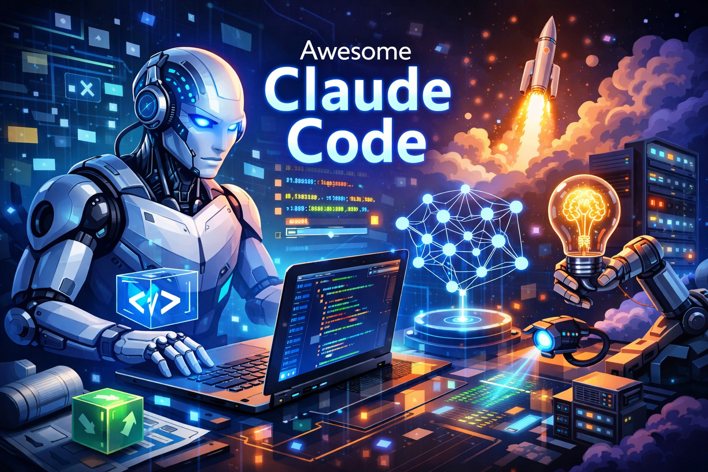

# Awesome Claude Code

A hand-picked collection of high-quality tools, plugins, and resources for Claude Code. Every repository listed here has earned 200+ GitHub stars from the developer community.

## Contents

- [Performance Champions](#-performance-champions)
- [Specialized Assistants](#-specialized-assistants)
- [Development Methodologies](#-development-methodologies)
- [Applications & Utilities](#-applications--utilities)
- [Memory & Context](#-memory--context)
- [Multi-Agent Orchestration](#-multi-agent-orchestration)
- [Terminal Displays](#-terminal-displays)
- [Event Automation](#-event-automation)
- [Quick Actions](#-quick-actions)
- [Project Configurations](#-project-configurations)
- [External Integrations](#-external-integrations)
- [Interface Options](#-interface-options)
- [Learning Resources](#-learning-resources)
- [Research & Deep Learning](#-research--deep-learning)
- [Browser Automation](#-browser-automation)
- [Companion CLI Tools](#-companion-cli-tools)

---

## ⭐ Performance Champions

The most starred repositories in the Claude Code ecosystem. These projects have proven their value through massive community adoption.

| Repository | Stars | Description |
|------------|-------|-------------|
| [everything-claude-code](https://github.com/affaan-m/everything-claude-code) |  | Complete optimization system with 28 agents, 125 skills, and 60+ commands for peak performance |
| [claude-code](https://github.com/anthropics/claude-code) |  | The official CLI from Anthropic that powers agentic coding in your terminal |
| [awesome-claude-skills](https://github.com/travisvn/awesome-claude-skills) |  | Massive collection of community skills for extending Claude capabilities |
| [gstack](https://github.com/garrytan/gstack) |  | Garry Tan's toolkit with 28 skills turning Claude into a virtual engineering team |
| [cherry-studio](https://github.com/CherryHQ/cherry-studio) |  | All-in-one AI productivity suite with smart chat and 300+ assistants |
| [claude-mem](https://github.com/thedotmack/claude-mem) |  | Auto-captures sessions and injects compressed context into future conversations |
| [skills](https://github.com/anthropics/skills) |  | Official repository for Anthropic-maintained agent skills |
| [agents](https://github.com/wshobson/agents) |  | Comprehensive package with 112 agents, 146 skills, and 79 tools |
| [awesome-claude-code](https://github.com/hesreallyhim/awesome-claude-code) |  | Curated list of skills, hooks, and plugins for Claude Code |

---

## 🤖 Specialized Assistants

Pre-configured agents designed to excel at specific tasks. Drop them into your workflow and let them handle domain-specific challenges.

| Repository | Stars | Description |
|------------|-------|-------------|
| [awesome-claude-code-subagents](https://github.com/VoltAgent/awesome-claude-code-subagents) |  | Collection of 100+ specialized subagents for development tasks |
| [awesome-claude-agents](https://github.com/rahulvrane/awesome-claude-agents) |  | Comprehensive directory of all available Claude Code agents |
| [awesome-claude-plugins](https://github.com/ComposioHQ/awesome-claude-plugins) |  | Production-ready plugins for workflow automation |

---

## 📋 Development Methodologies

Structured approaches and workflows that guide Claude through complex development tasks. These methodologies help maintain consistency across projects.

| Repository | Stars | Description |
|------------|-------|-------------|
| [awesome-claude-code-toolkit](https://github.com/rohitg00/awesome-claude-code-toolkit) |  | 135 agents, 42 commands, 150+ plugins, 19 hooks, and 7 templates |
| [claude-code-best-practice](https://github.com/shanraisshan/claude-code-best-practice) |  | Proven practices for effective Claude Code sessions |

---

## 🛠 Applications & Utilities

Standalone tools and applications built on top of Claude Code. These extend functionality beyond the terminal.

| Repository | Stars | Description |
|------------|-------|-------------|
| [ccusage](https://github.com/ryoppippi/ccusage) |  | Offline CLI analyzing your Claude Code usage from local files |
| [claude-squad](https://github.com/smtg-ai/claude-squad) |  | Manage multiple AI terminal agents including Aider and Codex |

---

## 🧠 Memory & Context

Tools for persisting knowledge across sessions. These help Claude remember previous conversations and maintain context over time.

| Repository | Stars | Description |
|------------|-------|-------------|
| [claude-mem](https://github.com/thedotmack/claude-mem) |  | Auto-captures sessions and compresses context with AI for future use |

---

## 🎭 Multi-Agent Orchestration

Manage and coordinate multiple Claude instances working together. Essential for complex tasks requiring parallel processing.

| Repository | Stars | Description |
|------------|-------|-------------|
| [claude-task-master](https://github.com/eyaltoledano/claude-task-master) |  | AI-powered task management for Cursor, Claude Code, Windsurf, and more |
| [beads](https://github.com/steveyegge/beads) |  | Distributed graph issue tracker with dependency-aware task graphs for AI agents |
| [vibe-kanban](https://github.com/BloopAI/vibe-kanban) |  | Kanban-style orchestration supporting 10+ coding agents |
| [claude-squad](https://github.com/smtg-ai/claude-squad) |  | Manage multiple AI terminal agents simultaneously |

---

## 📊 Terminal Displays

Customize your terminal with real-time Claude Code information. Track tokens, costs, and git status at a glance.

| Repository | Stars | Description |
|------------|-------|-------------|
| [claude-code-statusline-plugins](https://github.com/anthropics/skills) |  | Official statusline configurations from Anthropic |

---

## 🪝 Event Automation

Hook into Claude Code lifecycle events to run custom scripts. Automate tasks before and after tool execution.

| Repository | Stars | Description |
|------------|-------|-------------|
| [bouncer](https://github.com/buildingopen/bouncer) |  | Gemini-based quality audit gate with automated hooks |

---

## ⚡ Quick Actions

Slash commands for rapid task execution. Type a command and let Claude handle the rest.

| Repository | Stars | Description |
|------------|-------|-------------|
| [claude-code-system-prompts](https://github.com/Piebald-AI/claude-code-system-prompts) |  | Extracted system prompts updated with each Claude release |

**Popular Command Categories:**

- **Git Operations:** `/commit`, `/pr-create`, `/changelog`, `/release`, `/worktree`
- **Testing:** `/tdd`, `/test-coverage`, `/e2e`, `/integration-test`
- **Architecture:** `/plan`, `/refactor`, `/migrate`, `/adr`, `/diagram`
- **Documentation:** `/doc-gen`, `/api-docs`, `/onboard`
- **Security:** `/audit`, `/hardening`, `/secrets-scan`, `/csp`
- **DevOps:** `/dockerfile`, `/ci-pipeline`, `/k8s-manifest`, `/deploy`

---

## 📂 Project Configurations

CLAUDE.md templates providing project-specific guidance. Help Claude understand your codebase conventions.

| Repository | Stars | Description |
|------------|-------|-------------|
| [claude-code-best-practice](https://github.com/shanraisshan/claude-code-best-practice) |  | Proven practices for effective Claude Code sessions |
| [awesome-claude-code](https://github.com/jqueryscript/awesome-claude-code) |  | Tools, IDE integrations, and frameworks |

**Template Types:**

- **By Scope:** Minimal, Standard, Comprehensive, Monorepo, Enterprise
- **By Language:** Go, TypeScript, Python, Kotlin, Rust, Clojure
- **By Domain:** Game Development, Security Tools, Web Builders, Fullstack Apps

---

## 🔌 External Integrations

MCP servers connecting Claude Code to external services. Extend capabilities with third-party APIs.

| Repository | Stars | Description |
|------------|-------|-------------|
| [claude-code-mcp](https://github.com/steipete/claude-code-mcp) |  | Run Claude Code in one-shot mode with automatic permission handling |
| [n8n-mcp](https://github.com/czlonkowski/n8n-mcp) |  | Access to n8n's 1,239 workflow automation nodes |
| [claude-plugins-official](https://github.com/anthropics/claude-plugins-official) |  | Official Anthropic-managed plugin directory |

**Pre-configured Stacks:**

- Full Stack (GitHub, Supabase, Vercel)
- Data Science (Jupyter, pandas, scikit-learn)
- DevOps (Kubernetes, Terraform, AWS)
- Frontend (React, Vue, Tailwind)

---

## 📱 Interface Options

Alternative ways to interact with Claude Code beyond the terminal. Desktop apps, web interfaces, and IDE integrations.

| Repository | Stars | Description |
|------------|-------|-------------|
| [cherry-studio](https://github.com/CherryHQ/cherry-studio) |  | Feature-rich desktop GUI with session management |

---

## 📚 Learning Resources

Official documentation and educational materials from Anthropic.

| Resource | Description |
|----------|-------------|
| [Claude Code Documentation](https://docs.anthropic.com/en/docs/claude-code) | Official guides and API references |
| [Claude Code Quickstart](https://docs.anthropic.com/en/docs/claude-code/overview) | Get started in minutes |
| [Best Practices Guide](https://docs.anthropic.com/en/docs/claude-code/best-practices) | Recommended patterns and workflows |
| [Tutorials](https://docs.anthropic.com/en/docs/claude-code/tutorials) | Step-by-step guides |

---

## 🔬 Research & Deep Learning

Tools for autonomous research, experimentation, and deep learning workflows that integrate with Claude Code.

| Repository | Stars | Description |
|------------|-------|-------------|
| [autoresearch](https://github.com/karpathy/autoresearch) |  | Autonomous AI agents that conduct ML research on a single GPU overnight |
| [gpt-researcher](https://github.com/assafelovic/gpt-researcher) |  | Deep research agent generating comprehensive, cited reports from any data |
| [kotaemon](https://github.com/Cinnamon/kotaemon) |  | Clean RAG UI for chatting with documents using hybrid retrieval |
| [reader](https://github.com/jina-ai/reader) |  | Convert any URL to LLM-friendly input with a simple prefix |

---

## 🌐 Browser Automation

AI-powered browser control and web automation tools that complement Claude Code workflows.

| Repository | Stars | Description |
|------------|-------|-------------|
| [browser-use](https://github.com/browser-use/browser-use) |  | Make websites accessible for AI agents with natural language control |
| [stagehand](https://github.com/browserbase/stagehand) |  | AI browser automation framework combining natural language and code |

---

## 🖥 Companion CLI Tools

Alternative and complementary terminal-based AI coding assistants that work alongside Claude Code.

| Repository | Stars | Description |
|------------|-------|-------------|
| [gemini-cli](https://github.com/google-gemini/gemini-cli) |  | Google's open-source CLI bringing Gemini directly to your terminal |
| [OpenHands](https://github.com/All-Hands-AI/OpenHands) |  | AI-driven development platform with SDK, CLI, and local GUI |
| [codex](https://github.com/openai/codex) |  | OpenAI's lightweight coding agent running in your terminal |
| [aider](https://github.com/aider-ai/aider) |  | AI pair programming in your terminal with Git integration |
| [continue](https://github.com/continuedev/continue) |  | Source-controlled AI checks enforceable in CI pipelines |
| [SWE-agent](https://github.com/SWE-agent/SWE-agent) |  | Autonomous agent that fixes GitHub issues using LLMs |
| [plandex](https://github.com/plandex-ai/plandex) |  | Open-source AI coding agent for large projects with 2M token context |
| [pr-agent](https://github.com/Codium-ai/pr-agent) |  | AI-powered code review for GitHub, GitLab, Bitbucket, and Azure DevOps |

---

## Contributing

Found a great Claude Code resource with 200+ stars? Open an issue with:

1. Repository URL
2. Current star count
3. Brief description of what it does

---

## License

MIT License - Feel free to use and share this list.
